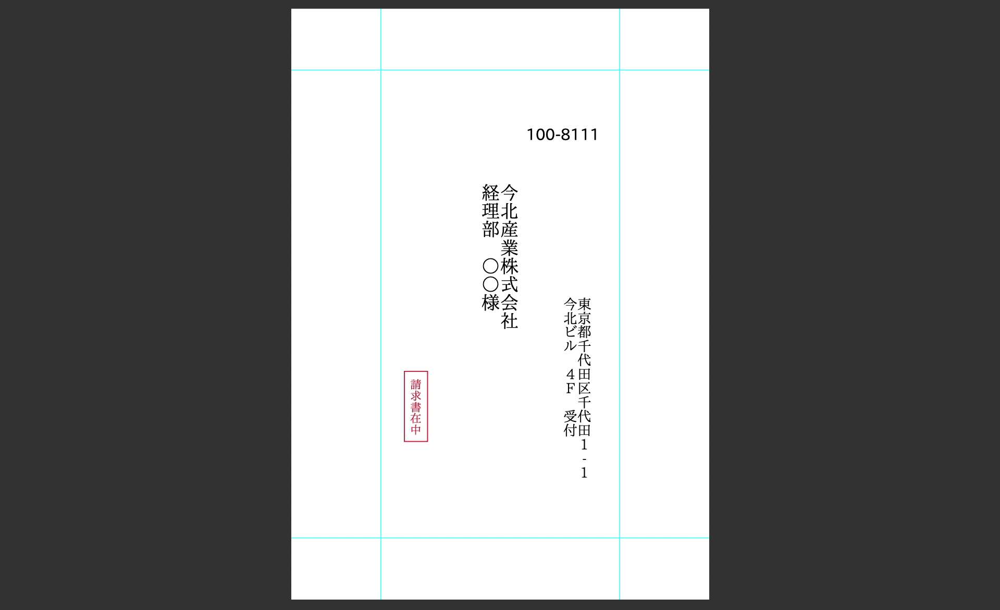
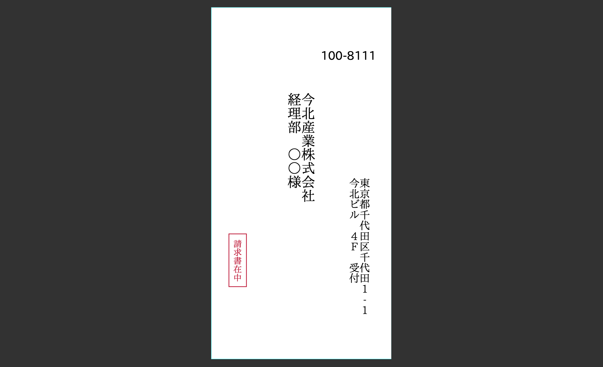

# 封筒作るん

JSON テンプレートから封筒に宛名とかの PDF 作るやつ

## Usage

```shell
$ ./main.py -t [TEMPLATE_PATH] -p [LAYOUT_PATH] <OUTPUT>
```

`TEMPLATE_PATH`: 宛先
`LAYOUT_PATH`: 封筒のレイアウト

宛名のサンプル: template.json
長形 3 号のサンプル: naga_3go.json

## 上手く動かなかったらすまん

うちのプリンターでしか動かんかもしれん

動作確認済み: ブラザー HL-L2365DW

## サンプル




[印刷結果](./docs/print_sample.pdf)

## ＩＰＡフォント

ＩＰＡフォントをバンドルしてるよ

[IPA_Font_License_Agreement_v1.0.txt](./fonts/IPA_Font_License_Agreement_v1.0.txt) 読んでね
